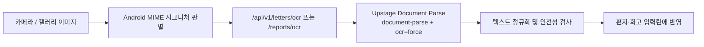
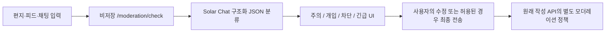

# 마음잇기 AI 활용 증빙

> **핵심 AI 제공자: Upstage**  
> 마음잇기는 Upstage Document Parse로 손글씨·문서 이미지를 편지/회고 입력란의 텍스트로 변환하고, Upstage Solar Chat으로 사용자 콘텐츠를 안전성 분류합니다. Solar Embedding 기반 의미 매칭도 코드와 데이터 계층까지 구현되어 있으며 운영 설정에 따라 단계적으로 활성화할 수 있습니다.

## 제출 정보

- 서비스: 지역 기반 연결 플랫폼 **마음잇기**
- Android 앱 + FastAPI 백엔드 + PostgreSQL/pgvector
- 운영 API: <https://backend-production-2f6a.up.railway.app>
- 시연 영상: [마음잇기 Android 시연 영상](docs/demo/slowtalk-demo.mp4)
- 검증 기준: `codex/semantic-matching-foundation` 브랜치
- 작성일: 2026-08-03

## Upstage API 활용 현황

| Upstage 기능 | 마음잇기 적용 지점 | 모델/호출 | 현재 상태 |
| --- | --- | --- | --- |
| **Document Parse** | 편지 쓰기·회고 리포트에서 카메라/갤러리 이미지의 문자를 입력란에 반영 | `POST /v1/document-digitization`, `document-parse`, `ocr=force` | **앱-운영 백엔드 연결 완료** |
| **Solar Chat** | 편지·피드·회고의 내용별 글쓰기 피드백 및 사용자 생성 콘텐츠 안전성 분류 | `POST /v1/chat/completions`, `UPSTAGE_CHAT_MODEL` | 글쓰기 피드백 연결 완료, 모더레이션은 **운영 `shadow` 모드** |
| **Solar Embedding** | 편지와 사용자 선호 벡터를 만들어 의미적으로 가까운 이웃 후보 검색 | `POST /v1/embeddings`, `embedding-query` / `embedding-passage`, 1,024차원 | 구현·테스트 완료, `MATCHING_MODE`로 `disabled/shadow/enforce` 제어 |

API 키 값은 저장소와 로그에 남기지 않고 운영 환경 변수 `UPSTAGE_API_KEY`로만 주입합니다.

## 1. Upstage Document Parse OCR

Android 앱은 선택한 파일의 실제 JPEG/PNG/WebP 시그니처를 확인해 정확한 MIME 타입으로 업로드합니다. 백엔드는 파일 크기와 형식을 검증한 뒤 Upstage Document Parse에 multipart 요청을 보내고, 응답의 일반 텍스트·Markdown·HTML·element 형식을 하나의 텍스트로 정규화합니다.



코드 증거:

- [Upstage Document Parse 요청과 응답 정규화](backend/app/ai/gateway.py#L49-L132)
- [편지·회고 OCR API](backend/app/ai/router.py#L43-L93)
- [Android 편지 MIME 판별](app/src/main/java/com/apptive/slowtalk/data/repository/LetterRepository.kt#L33-L65)
- [Android 회고 OCR 업로드](app/src/main/java/com/apptive/slowtalk/data/repository/ReportRepository.kt#L21-L29)
- [Document Parse multipart/HTML/오류 테스트](backend/tests/ai/test_upstage_writing_assistant.py)

## 2. Upstage Solar Chat 안전성 분류

Solar Chat에는 원문을 생성시키는 대신 엄격한 JSON 분류를 요청합니다. 모델 출력은 `decision`, `categories`, `severity`, `confidence`, `reason` 구조로 검증한 뒤 `ALLOW`, `REVIEW`, `BLOCK`으로 정규화합니다. 분류 범주는 혐오, 괴롭힘, 성적 콘텐츠, 폭력, 자해, 개인정보, 스팸이며 심각도와 신뢰도 임계값도 함께 적용합니다.

### 앱의 4단계 안전 개입

Android 앱은 편지, 피드와 채팅 메시지의 최종 작성 API를 호출하기 전에 `POST /api/v1/moderation/check`로 사전검사를 수행합니다. 이 엔드포인트는 분류 결과를 반환할 뿐 입력 원문이나 제출 상태를 마음잇기 데이터베이스에 저장하지 않으며, 실제 콘텐츠 생성도 수행하지 않습니다. 입력 원문은 안전성 분류 목적으로 Upstage API에 전송되므로 “서비스 DB 비저장”과 “외부 처리 없음”을 구분합니다.

| 사용자 단계 | 구조화 분류 매핑 | 앱 동작 |
| --- | --- | --- |
| **주의 (`CAUTION`)** | 낮은 심각도의 `REVIEW` | 표현 재확인 안내. 즉시 수정하거나 그대로 전송 가능 |
| **개입 (`INTERVENTION`)** | 낮음보다 높은 심각도의 `REVIEW` | 5초 숙려 후 전송 가능, 또는 수정 |
| **차단 (`BLOCK`)** | 신뢰도 정책 적용 후 `BLOCK` | 그대로 전송 불가, 수정만 가능 |
| **긴급 (`EMERGENCY`)** | `SELF_HARM` 또는 `VIOLENCE`와 `CRITICAL`의 조합 | 전송 불가. 자살예방상담전화 **109**, 경찰 **112**, 구급·소방 **119** 안내 표시 |



이 개입은 콘텐츠 위험도를 조절하기 위한 장치입니다. AI 판정만으로 계정을 자동 정지·탈퇴시키거나 사용자에게 자동 제재를 누적하지 않습니다. `BLOCK`과 `EMERGENCY` 응답의 `operatorReviewRecommended`는 앱에서 “운영자 검토가 권고됨”을 알리는 신호이며, **비저장 사전검사 자체가 운영자 검토 제출을 생성하지는 않습니다.**

- [Solar Chat 호출과 구조화 응답 파싱](backend/app/moderation/upstage_gateway.py#L12-L154)
- [비저장 사전검사 API와 응답 스키마](backend/app/moderation/router.py)
- [4단계 판정 매핑](backend/app/moderation/service.py)
- [Android 공통 개입 UI](app/src/main/java/com/apptive/slowtalk/Components.kt)
- [모더레이션 처리 워커](backend/app/moderation/worker.py)
- [민감정보 로그 마스킹](backend/app/core/redaction.py)
- [Solar Chat 응답·오류·프라이버시 테스트](backend/tests/moderation/test_upstage_gateway.py)
- [비저장 사전검사와 4단계 매핑 테스트](backend/tests/moderation/test_safety_check.py)
- [OCR 결과 모더레이션 테스트](backend/tests/moderation/test_ocr_moderation.py)

운영 준비 상태 API의 2026-08-03 응답은 다음과 같습니다. 즉, Solar Chat 모더레이션이 설정된 `shadow` 상태이며 로컬 fallback으로 대체되지 않았습니다.

```json
{
  "status": "ready",
  "moderationMode": "shadow",
  "moderationConfigured": true,
  "fallbackActive": false
}
```

`shadow` 모드는 사용자 요청을 차단하지 않으면서 실제 분류 결과를 관찰하는 안전한 도입 단계입니다. 현재도 앱의 비저장 사전검사와 4단계 UI는 동작하지만, 사전검사 후 사용자가 보낸 원래 작성 요청은 서버에서 모더레이션 결과 때문에 보류되거나 차단되지 않습니다.

실제 서버 강제는 `MODERATION_MODE=enforce`에서만 적용됩니다. 이때 원래 작성 API에서 `REVIEW`로 판정된 명령은 암호화 저장되고 `202 PENDING_REVIEW`로 보류되며, `BLOCK`은 `422 CONTENT_POLICY_VIOLATION`으로 거절됩니다. 즉, 앱의 사전 안내와 서버의 저장·보류·차단은 서로 다른 요청 경계입니다. 운영자 검토 대기열도 `enforce`의 실제 제출 흐름에서 생성되며, 사전검사 호출만으로는 생성되지 않습니다.

### Solar Chat 글쓰기 피드백

편지·피드·회고 본문과 작성 맥락을 Solar Chat에 전달하고, 해당 글에서 발견한 구체적인 감정·장면·주제를 요약과 1~3개의 수정 제안으로 받습니다. 모델 출력은 엄격한 JSON 스키마로 검증하며, 사용자 글 안의 지시문은 명령이 아닌 분석 대상 텍스트로 취급합니다.

- [Solar Chat 글쓰기 프롬프트·호출·응답 검증](backend/app/ai/gateway.py)
- [입력 내용별 피드백 및 오류 처리 테스트](backend/tests/ai/test_upstage_writing_assistant.py)

## 3. Upstage Solar Embedding 의미 매칭

단순 키워드 일치가 아니라 편지 내용과 사용자 선호를 1,024차원 벡터로 표현해 코사인 유사도가 높은 후보를 검색합니다. 쿼리와 문서 목적에 맞춰 Upstage의 `embedding-query`, `embedding-passage` 별칭을 구분하고, 잘못된 차원이나 응답 순서는 즉시 오류로 처리합니다.

- [Upstage embedding gateway](backend/app/matching/upstage_gateway.py)
- [의미 매칭 정책](backend/app/matching/semantic_policy.py)
- [pgvector 모델과 HNSW 인덱스](backend/app/matching/models.py)
- [매칭 서비스](backend/app/matching/service.py)
- [embedding 호출·차원 검증 테스트](backend/tests/matching/test_upstage_embedding_gateway.py)
- [pgvector 검색 테스트](backend/tests/matching/test_pgvector_search.py)

운영 전환은 환경 변수 `MATCHING_MODE=disabled|shadow|enforce`와 `MATCH_MIN_SIMILARITY`로 제어합니다. 이 문서는 구현 완료와 운영 활성화를 구분해, 현재 확인되지 않은 운영 매칭 결과를 과장하지 않습니다.

## 4. AI 설정과 보안

| 환경 변수 | 용도 | 저장소 기본 예시 |
| --- | --- | --- |
| `UPSTAGE_API_KEY` | 모든 Upstage API 인증 | 값 미포함 |
| `UPSTAGE_BASE_URL` | Upstage API 주소 | `https://api.upstage.ai/v1` |
| `UPSTAGE_DOCUMENT_MODEL` | OCR 문서 모델 | `document-parse` |
| `UPSTAGE_CHAT_MODEL` | 글쓰기 피드백·안전성 분류 Solar 모델 | 운영 환경에서 지정 |
| `UPSTAGE_EMBEDDING_MODEL` | 의미 벡터 모델 | `solar-embedding-2` |
| `MODERATION_MODE` | 모더레이션 관찰/강제 | `shadow` 또는 `enforce` |
| `MATCHING_MODE` | 의미 매칭 비활성/관찰/강제 | `disabled`, `shadow`, `enforce` |

설정 정의와 강제 모드 검증은 [backend/app/core/config.py](backend/app/core/config.py)에, 비밀값 없는 예시는 [backend/.env.example](backend/.env.example)에 있습니다.

## 5. 검증 결과

2026-08-03에 현재 브랜치에서 다음 Upstage 연동 테스트를 실행했습니다.

```powershell
backend\.venv\Scripts\pytest.exe `
  backend\tests\ai\test_upstage_writing_assistant.py `
  backend\tests\matching\test_upstage_embedding_gateway.py `
  backend\tests\moderation\test_upstage_gateway.py `
  backend\tests\moderation\test_ocr_moderation.py -q
```

결과: **74 passed**

검증 범위에는 multipart 파일 전송, MIME 타입, OCR 응답 정규화, 입력별 Solar Chat 글쓰기 피드백, Solar Chat JSON 파싱, Upstage 오류 매핑, 민감정보 비노출, embedding 순서와 1,024차원 검증이 포함됩니다. 시연 영상에서는 실제 Android 앱의 갤러리 이미지를 편지 입력란으로 변환하는 전체 흐름을 확인할 수 있습니다.

### 시연 영상 구성

- `00:00` 변경된 **오늘의 편지** 홈과 편지 쓰기 진입
- `00:10` 갤러리에서 한글 편지 이미지 선택
- `00:15` 이후 Upstage Document Parse 처리와 추출된 한글 본문의 입력란 반영
- 후반부 저장된 대화방과 피드 화면 확인

영상 파일은 1분 36초의 Android 에뮬레이터 실제 화면 녹화본입니다. 주요 동작을 설명하는 한글 자막을 영상에 직접 삽입했으며, 원문 자막은 [SRT 파일](docs/demo/slowtalk-demo.srt)로도 제공합니다.

## 6. AI 사용 범위에 대한 명시

- **Upstage 사용으로 산정하는 기능:** Document Parse OCR, Solar Chat 글쓰기 피드백·안전성 분류, Solar Embedding 의미 매칭 구현.
- **로컬 fallback 범위:** `UPSTAGE_API_KEY` 또는 `UPSTAGE_CHAT_MODEL`이 없는 개발 환경에서만 결정적 fallback을 사용합니다. 운영 설정이 완료된 환경에서는 편지·피드·회고의 실제 본문을 Solar Chat이 분석합니다.
- 앱의 인증, 피드 CRUD, 댓글, 채팅방, 메시지, 시간 표기 등 일반 기능은 AI가 아닌 제품 백엔드·프론트엔드 기능입니다.

## 7. AI 개발 도구 활용

프로젝트 구현·디버깅·테스트 자동화에는 OpenAI Codex를 사용했습니다. 대표 작업은 다음과 같습니다.

- FastAPI API와 Android Retrofit/Compose 연결 구현 및 문제 진단
- Upstage gateway, 오류 매핑, fallback과 기능 플래그 구현
- OCR의 실제 파일 시그니처 기반 MIME 처리 수정
- 댓글·피드·그룹/익명 채팅과 상대 시간 표기 회귀 수정
- pytest, Android 빌드, 에뮬레이터, 운영 준비 상태를 통한 반복 검증

최종 기능 판단은 실행 코드, 자동화 테스트와 에뮬레이터/운영 API 확인 결과를 기준으로 검증했습니다.
